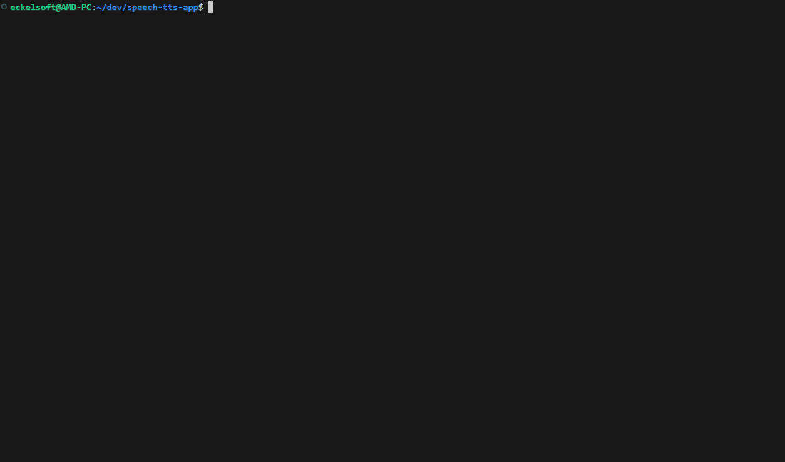

# Speech-To-Speech Web-Anwendung für Echtzeit Spracherkennung und TTS

Eine Web-Anwendung zur Echtzeit-Transkription von Spracheingaben mit direkter Text-to-Speech-Wandlung.
- Starte docker mit `./rebuild_and_run.sh`
- Anwendung benutzen auf `http://localhost:8080`

---


---



---

### ✨ Features

- 🎤 **Echtzeit-Transkription:** Sprache wird live im Browser in Text umgewandelt.
- 🎨 **Dynamische Texthistorie:** Finaler Text wird angezeigt, während vorläufiger Text farblich hervorgehoben wird.
- 🔊 **Text-to-Speech (TTS):** Ein Python-Backend generiert aus dem erkannten Text Sprache.
- 🎧 **Intelligente Audio-Warteschlange:** Generierte Audiodateien werden nacheinander abgespielt und danach automatisch gelöscht.
- ⚙️ **Erweiterte Steuerung:** Pausieren, Fortsetzen und sofortiges Stoppen der Wiedergabe.
- 🌐 **Flexible Anpassung:** Wiedergabegeschwindigkeit und Pausenerkennung sind einstellbar.
- ✍️ **Smarte Interpunktion:** Erkennt Sprachbefehle wie "Punkt" oder "Fragezeichen".

### 🛠️ Tech-Stack

- **Frontend:** HTML5, CSS3, JavaScript (Web Speech API)
- **Web-Server:** Node.js / Express
- **TTS-Server:** Python / Flask / gTTS
- **Deployment:** Docker

---

## 🚀 Quick Start (Empfohlen)

Der einfachste Weg, die Anwendung zu starten. Docker muss installiert sein und laufen.

1.  **Skript ausführbar machen (einmalig)**
    ```bash
    chmod +x rebuild_and_run.sh
    ```

2.  **Skript ausführen**
    ```bash
    ./rebuild_and_run.sh
    ```

3.  **Anwendung öffnen**
    Öffne deinen Browser und gehe zu **`http://localhost:8080`**. Fertig!

---

## 👨‍💻 Informationen für Entwickler

Die folgenden Abschnitte sind für die manuelle Installation und Entwicklung gedacht.

### Manuelle Installation & Start

**Voraussetzungen**
- **Node.js** (v18.x oder neuer)
- **Python** (v3.8 oder neuer)

**1. Python Backend einrichten**
```bash
cd backend_python
python3 -m venv venv && source venv/bin/activate
pip install -r requirements.txt
cd ..
```

**2. Node.js Frontend einrichten**
```bash
cd backend_node
npm install
cd ..
```

**3. Anwendung starten (zwei Terminals benötigt)**

* **Terminal 1: Python TTS-Server**
    ```bash
    cd backend_python
    source venv/bin/activate
    waitress-serve --host 127.0.0.1 --port=5000 tts_server:app
    ```
* **Terminal 2: Node.js Web-Server**
    ```bash
    cd backend_node
    node server.js
    ```

Öffne anschließend **`http://localhost:8080`** im Browser.

### Docker Container verwalten

```bash
docker logs -f speech-app-container
docker stop speech-app-container
docker rm speech-app-container
```

### Anwendung nach Code-Änderungen aktualisieren

Wenn du Docker nutzt und Änderungen am Code vorgenommen hast, nutze das `rebuild_and_run.sh` Skript.

1.  **Skript ausführbar machen (einmalig)**
    ```bash
    chmod +x rebuild_and_run.sh
    ```

2.  **Skript ausführen**
    ```bash
    ./rebuild_and_run.sh
    ```

---

### 📂 Projektstruktur
```text
speech-tts-app/
├── backend_node/
│   ├── public/         # Frontend (HTML, JS, CSS)
│   └── server.js       # Node.js Webserver
├── backend_python/
│   └── tts_server.py   # Python TTS-Server
├── tts_audio/          # Temporärer Speicher für MP3s
├── Dockerfile          # Bauanleitung für Docker
├── start.sh            # Start-Skript für den Container
└── README.md
```

---

### 📄 Lizenz

Dieses Projekt steht unter der MIT-Lizenz.

Made with AI.